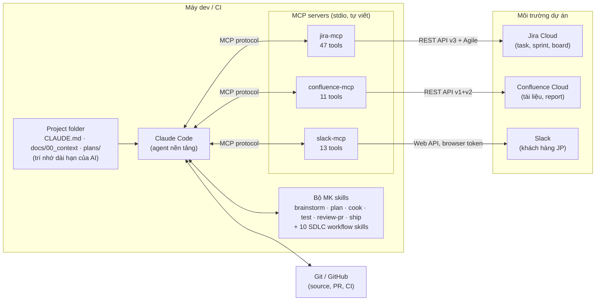

# AI Toolkit for Offshore Teams — Claude Code + MyKit + MCP

> Tài liệu giới thiệu năng lực: mindset, cách tổ chức dự án, và bộ công cụ tôi đã tự xây dựng và vận hành, phủ toàn bộ SDLC — từ nhận yêu cầu, lập kế hoạch, code, test, review đến báo cáo — và cả công việc điều phối của PM/PO/BrSE. Toàn bộ đang chạy thật, không phải concept.

## 1. Bức tranh tổng thể

Mục tiêu chung của các dự án dạng này: **đưa AI vào mọi công đoạn SDLC** trong môi trường Jira + Confluence (task/tài liệu) và Slack (khách hàng JP). Không dừng ở các hạng mục hay được nêu (unit test, code review, test case generation, auto-reporting) — với cùng bộ công cụ và kết nối, tự động hóa được cả lớp việc của **PM/PO/BrSE**: daily report, performance report, meeting note, stakeholder management.

Bộ công cụ này không bắt đầu từ tool, mà bắt đầu từ **một mindset** (Context Engineering — mục 2), được cụ thể hóa thành **cách tổ chức project folder** (mục 3), rồi mới đến kiến trúc 3 lớp lấy **Claude Code làm nền tảng thực thi** (mục 4 trở đi):

| Lớp | Thành phần | Vai trò |
|---|---|---|
| **Nền tảng** | Claude Code | Agent thực thi: đọc/sửa code, chạy lệnh, orchestrate subagents |
| **Quy trình** | Bộ MK (MyKit) — 30+ skills + rules | Chuẩn hóa workflow: brainstorm → plan → cook → test → review → ship, mỗi bước là một skill có kiểm soát |
| **Kết nối** | 3 MCP servers tự viết (Jira / Confluence / Slack) | Nối agent vào môi trường làm việc thật của dự án |

## 2. Mindset: Context Engineering — từ Vibe Coder đến AI Orchestrator

Nền tư duy của toàn bộ bộ công cụ nằm ở [Context Engineering Mindset](../00-foundations/context-engineering-mindset.md), viết lại từ bài đã đăng công khai [Context Engineering: từ Vibe Coder đến AI Orchestrator](https://phucnt.substack.com/p/context-engineering-tu-vibe-coder). Ý chính để đọc tiếp tài liệu này:

- **Vibe coder** prompt rồi hy vọng; **AI orchestrator** xây ngữ cảnh trước rồi mới giao việc. Cùng một dự án MCP server, cách một tốn 5 ngày cho 4/11 tool, cách hai tốn 3 ngày cho 11/11.
- Ngữ cảnh có bốn thành phần: tri thức dài hạn, luật hành xử, trạng thái hiện tại, công cụ và giao diện. Mỗi thành phần sống ở một chỗ, và **agent đọc ngữ cảnh trước khi đọc prompt**.
- Khung gốc có hai bước: xây trí nhớ dài hạn (`00_context/`) và đặt luật (`CLAUDE.md`). Bước 3 là nói với agent: *"Bạn biết phải làm gì rồi đấy."*

Mọi thứ từ mục 3 trở đi là **phiên bản công nghiệp hóa** của đúng khung này, để nhân bản cho cả team thay vì một cá nhân.

## 3. Tổ chức project folder — 00_context + chuẩn MK

Từ blog, phần được giữ nguyên làm nền móng là **`00_context/` — AI's Long-term Memory**. Phần còn lại (plan, sprint execution, rules) không cần tự chế nữa: bộ MK đã chuẩn hóa sẵn, và chính các skill MK đọc/ghi đúng chỗ. Layout chuẩn cho mọi repo dự án:

```
project/
├── CLAUDE.md                  # AI's Rules — contract ngắn, luôn được nạp
├── .claude/
│   ├── rules/                 # rules module hóa (development, review, docs…), nạp theo ngữ cảnh
│   └── skills/                # bộ MK + các workflow skill của dự án
├── docs/
│   ├── 00_context/            # AI's Long-term Memory (giữ từ blog — không sửa khi chưa duyệt)
│   │   ├── requirements.md    #   mục tiêu business, tiêu chí thành công
│   │   ├── implementation-guide.md  # kiến trúc, coding patterns
│   │   └── reference.md       #   project key, board, space, channel… của dự án
│   ├── code-standards.md      # /mk:review-pr đọc làm chuẩn review
│   ├── system-architecture.md
│   └── project-roadmap.md     # trạng thái + hướng đi (status first)
└── plans/                     # /mk:plan sinh ra, /mk:cook thực thi
    └── {date}-{slug}/
        ├── plan.md            # status, phases, acceptance criteria
        ├── phase-XX-*.md      # chi tiết đủ để thực thi an toàn từng phase
        └── reports/           # report sau mỗi phase / review
```

Cấu trúc này không phải quy ước trang trí — **vòng đời một việc đi đúng qua nó**: `/mk:brainstorm` đọc `docs/` + `00_context/` để phân tích trade-off → `/mk:plan` chốt thành `plans/{date}-{slug}/` có acceptance criteria → `/mk:cook` thực thi từng phase, chỉ đóng khi quality gate pass → `/mk:review-pr` review theo `docs/code-standards.md` → report ghi vào `reports/`. Các workflow skill (mục 6) lấy mặc định dự án (project key, space, channel) từ `00_context/reference.md` — khai báo một lần, mọi skill dùng chung.

Nguyên tắc vận hành kèm theo (quan trọng ngang cấu trúc): **single source of truth** — mỗi thông tin sống ở một chỗ, link thay vì lặp; **status first** — overview luôn hiện trạng thái, chi tiết đẩy xuống tài liệu con; **phân quyền sửa** — `00_context/` là nền móng, không sửa khi chưa được duyệt.

Điểm mấu chốt khi thuyết phục team dùng: **AI đọc project folder trước khi đọc prompt**. Một dev mới (người hay AI) vào repo được tổ chức thế này sẽ tự trả lời được "dự án làm gì, đang ở đâu, chuẩn code ra sao, việc tiếp theo là gì" — không phụ thuộc trí nhớ của bất kỳ ai.

## 4. Topology



Đọc topology theo mindset mục 2: **project folder cấp bối cảnh** cho agent, **MK cấp quy trình**, **MCP cấp cánh tay** vươn tới Jira/Confluence/Slack. Thiếu lớp nào cũng quay lại vibe coding.

Điểm thiết kế đáng chú ý ở lớp MCP:

- **Ngôn ngữ thiết kế thống nhất** giữa 3 server: mọi tool trả về cùng một JSON envelope `{ok, data, meta}` / `{ok:false, error:{code, message, hint}}` với bộ error code chung — AI client chỉ cần **một** chiến lược parse cho cả 3 hệ thống; lỗi kèm `hint` chỉ cách khắc phục để agent tự phục hồi (ví dụ `CONFLICT` khi update trang Confluence → hint bảo đọc lại version rồi retry).
- **Validation bằng zod** tại biên: input sai bị chặn trước khi chạm API, tham số đồng nhất (`channel_id` mọi nơi, `fields`/`expand` nhận cả string lẫn array).
- **Slack dùng browser token** (xoxc/xoxd) — không cần cài app, không cần admin duyệt scope: đúng lời giải cho workspace doanh nghiệp bị khóa, agent thừa hưởng đúng tầm nhìn của user thật (private channel, DM).
- 3 server độc lập, cài qua npm, cắm vào bất kỳ MCP client nào (Claude Code, Claude Desktop, Cline, Cursor) — team offshore chỉ cần khai báo trong config.

## 5. Bộ MK — "AI's Rules" công nghiệp hóa cho team

Bước 2 của framework (AI's Rules) ở quy mô cá nhân là một file `CLAUDE.md`. Ở quy mô team, nó thành MyKit: bộ skill + rule để **mọi phiên làm việc của AI đều theo cùng một quy trình, thay vì phụ thuộc "tay nghề prompt" của từng người** — Startup Workflow, Task Lifecycle, Quality Gates trong blog giờ là những skill gọi được:

| Công đoạn | Skill MK | Việc AI làm |
|---|---|---|
| Requirement / Design | `brainstorm`, `research`, `mk-plan`, `design` | Phân tích trade-off, nghiên cứu solution, ra plan chia phase có acceptance criteria (ghi vào `plans/` — mục 3) |
| Implementation | `cook`, `fix`, `scout` | Thực thi plan, sửa bug có quy trình chứng minh nguyên nhân trước khi sửa |
| Unit test / QA | `test` | Chạy unit/integration/e2e, phân tích coverage — Quality Gate "all tests pass" trước khi task được đóng |
| Code review / Security | `mk-code-review`, `review-pr`, `mk-security` | Review theo evidence và `docs/code-standards.md`, quét bảo mật STRIDE/OWASP |
| Documentation | `docs`, `docs-seeker` | Sinh/cập nhật tài liệu từ codebase — giữ `docs/` (trí nhớ dài hạn) khớp thực tế |
| Release / Report | `git`, `ship`, `retro`, `watzup` | Commit chuẩn conventional, pipeline ship, retro từ git metrics, handoff report |
| Điều phối (PM) | `ghpm`, `kanban`, `plans-kanban`, `project-management` | Quản lý issue/PR GitHub, nhìn kanban trạng thái plan, điều phối tiến độ |

Kèm **rule system** (development rules, review rules, documentation rules) nạp theo ngữ cảnh — đây chính là dạng "guild + training material" có thể nhân bản cho team offshore: skill là tài liệu sống, ai dùng Claude Code là dùng đúng quy trình.

## 6. Use case — MK làm xương sống, workflow skill nối ra ngoài

### 6.1 Vòng phát triển hằng ngày (thuần MK)

Một feature đi từ ý tưởng đến ship không cần rời Claude Code:

```
/mk:brainstorm  →  /mk:plan  →  /mk:cook  →  /mk:test  →  /mk:review-pr  →  /mk:ship
   (trade-off)     (plans/…)    (từng phase)   (quality gate)  (theo code-standards)  (release)
```

Chính đợt hợp nhất 3 MCP server (7 phase, từ refactor envelope đến E2E) chạy bằng đúng vòng này — plan, phase report, review đều nằm trong `plans/` làm bằng chứng.

### 6.2 Workflow skill cho vòng dev (6 skill, nối MK ra Jira/Confluence/Slack)

Mỗi skill < 60 dòng, tự chứa, lấy mặc định dự án từ `00_context/reference.md`:

| # | Skill | Chuỗi tool | Công đoạn |
|---|---|---|---|
| 1 | `slack-thread-to-jira-epic` | Slack `get_thread_replies` → Jira `createIssue` (Epic+Stories) → Confluence requirements page → Block Kit xác nhận | Requirement intake từ trao đổi khách — đầu vào cho `/mk:brainstorm` |
| 2 | `cross-tracker-bug-triage` | Jira `enhancedSearchIssues` (JQL) × Slack `search_messages` → tổng hợp → comment/tạo bug | Bug analysis — trước khi `/mk:fix` |
| 3 | `jira-sprint-management` | `listSprints`/`getSprintIssues` + ngữ cảnh Slack → `addIssueToSprint`/`transitionIssue` | Quản lý sprint |
| 4 | `sprint-report-to-confluence-slack` | Jira sprint data → metrics → Confluence report → Slack Block Kit **song ngữ Nhật-Anh** (kính ngữ) | Auto-reporting cho khách JP |
| 5 | `jira-story-test-case-generation` | Jira `getIssue` (AC) → test case (happy/boundary/negative, traceability 1:1 với AC) → Confluence bảng → link ngược story | Test case generation — bổ trợ `/mk:test` |
| 6 | `code-review-findings-to-jira` | Finding review → Jira Bug/Task theo severity → Block Kit summary | Khép vòng `/mk:review-pr` vào tracker |

**Đã kiểm chứng end-to-end trên hệ thống thật** (2026-08-17): workflow #4 chạy xuyên cả 3 server — đọc sprint từ Jira, tạo trang report trên Confluence, gửi Block Kit song ngữ JP/EN vào Slack, rồi dọn sạch artifact theo đúng kỷ luật cleanup định nghĩa trong skill.

### 6.3 Workflow skill cho PM / PO / BrSE (4 skill)

Cùng bộ kết nối đó tự động hóa lớp việc điều phối — phần chiếm nhiều thời gian nhất của PM/PO/BrSE mà ít kế hoạch "AI vào SDLC" nào chạm tới:

| # | Skill | Chuỗi tool | Việc thay thế |
|---|---|---|---|
| 7 | `daily-standup-report` | Jira JQL `updated >= -1d` nhóm theo assignee + quét blocker trong Slack → Block Kit daily report | PM tổng hợp daily thủ công |
| 8 | `team-performance-report` | Sprint đã đóng (`listSprints`/`getSprintIssues`) → velocity, completion, carry-over, tỉ lệ bug → Confluence page → Slack | Performance report định kỳ |
| 9 | `meeting-notes-to-actions` | Thread/transcript → Confluence meeting note (decisions, actions, open questions) → Jira Task per action → confirm vào thread | Meeting note + theo dõi action item |
| 10 | `stakeholder-status-update` | Epic progress + risk (JQL overdue/flagged) → Confluence status page → Slack **JP kính ngữ** cho khách (進捗/課題/対応方針) | PO/BrSE viết status update cho stakeholder |

Kỷ luật chung của cả 4: số liệu chỉ lấy từ dữ liệu Jira đã đọc (không ước lượng, không làm đẹp trạng thái — Delayed không được viết mềm thành At risk); không bịa owner/deadline trong meeting note; báo cáo team không xếp hạng cá nhân.

## 7. Nhân bản cho team offshore

Lộ trình đưa bộ công cụ vào dự án — theo đúng thứ tự của framework: context trước, tool sau:

1. **Dựng project folder** (mục 3) — bootstrap `CLAUDE.md` + `docs/00_context/` (requirements, implementation guide, reference) + khung `plans/`. Dùng chính AI sinh phần lớn tài liệu; con người duyệt. Đây là bước 2 giờ mà Vibe Coder hay bỏ qua.
2. **Cài công cụ** — 3 MCP server qua npm + config MCP client; bộ MK copy vào repo dự án (`.claude/`). Không cần hạ tầng mới.
3. **Khai báo dự án một lần** — điền `00_context/reference.md`: project key, board, space, channel, coding convention (Java/Python), JQL/CQL mẫu. Mọi skill (dev lẫn PM) đọc chung từ đây thay vì hỏi lại từng lần.
4. **Guild & training** — bản thân skill là tài liệu training: mỗi skill mô tả input, các bước, failure handling, cleanup. Quy tắc giao tiếp khách JP (song ngữ, kính ngữ) đã mã hóa sẵn trong skill #4 và #10. Nội dung mindset (mục 2) là bài mở đầu khóa training: đổi cách nghĩ trước, đổi tool sau.
5. **Mở rộng** — cùng pattern envelope + zod có thể viết thêm MCP server cho hệ thống nội bộ khác (GitLab, Redmine, DB nội bộ…) trong vài ngày, vì đã có 3 server làm khuôn; cùng khuôn skill có thể đóng gói thêm workflow đặc thù dự án.

## 8. Trạng thái

- 3 MCP server: build sạch, 47/11/13 tools, đã publish npm (`mcp-jira-cloud-server`, `confluence-cloud-mcp-server`, `slack-browser-mcp-server`), test live nhiều pattern (success / validation-fail / error-classification / cache).
- 10 workflow skill (6 dev + 4 PM/PO/BrSE): hoạt động; workflow sprint-report đã chạy E2E xuyên 3 hệ thống thật.
- Bộ MK + cấu trúc folder: đang dùng hằng ngày trong chính các repo của tôi — chính tài liệu này và toàn bộ đợt refactor 3 MCP server vừa rồi được thực hiện bằng đúng quy trình đó (plan trong `plans/`, phase có acceptance criteria, report sau mỗi phase).
- Mindset đã công bố công khai: [Context Engineering: từ Vibe Coder đến AI Orchestrator](https://phucnt.substack.com/p/context-engineering-tu-vibe-coder) — dùng làm tài liệu mở đầu cho guild/training.
- Bước tiếp theo của bộ công cụ này — tổ chức dữ liệu Jira/Confluence/Slack/spec/DB thành AI-ready và vận hành agent chạy nền có kiểm soát — trình bày ở [Triển khai AI trong doanh nghiệp](../01-ai-ready-enterprise/README.md).
