# Proposal: Enterprise AI Adoption on Three Pillars

*Dành cho lãnh đạo. 10 phút đọc. Chi tiết kỹ thuật nằm ở nhánh
[`engineering/`](../engineering/), tài liệu này chỉ link tới, không kể lại.*

## Vấn đề

Công ty không thiếu tri thức. Nó nằm trong Jira, Confluence, Slack, source
code, DB của hệ thống khách, spec tiếng Nhật, biên bản họp, và trong đầu vài
PM/BrSE lâu năm. Thứ thiếu là **AI không với tới được** tri thức đó theo cách
dùng được ngay: dữ liệu khóa sau đăng nhập, trường không có tài liệu, con số
quan trọng (velocity thật, rủi ro carry-over, tình trạng blocker) phải tính
bằng công thức chỉ một người biết, và "ngữ cảnh" (khách đang tranh chấp
scope, team đang thiếu người) chỉ tồn tại trong trí nhớ.

Hệ quả mà tôi quan sát ở nhiều dự án AI: chúng không chết ở model. Chúng chết
ở **dữ liệu** và ở phần **dây nối** giữa model và dữ liệu. Model đổi được
trong một dòng cấu hình; dữ liệu và dây nối thì không ai làm thay được.

## Đề xuất

[Bản tương tác](../diagrams/enterprise-ai-three-pillars.architecture.html)

| Trụ cột | Nội dung | Ai làm | Công sức |
|---|---|---|---|
| **1. Harness sẵn có** | Claude Code, OpenClaw, OpenCode… cung cấp vòng lặp agent, phiên, kênh chat, lịch chạy, bộ nhớ, transcript | Cấu hình, không viết | ~10% |
| **2. Dữ liệu AI-ready** | Lưu nguyên bản → bảng có kiểu → chỉ số dẫn xuất có nguồn → **bộ tri thức** cho agent (hỏi gì ở đâu, ngưỡng nào tin được, dữ liệu *không* nói được gì) | Đội data + chủ nghiệp vụ | ~60% |
| **3. Kết nối và giao diện** | Một lệnh/tool trả JSON kèm ngữ cảnh; đọc và ghi tách riêng; CLI trước, MCP khi có harness thứ hai, API khi tách máy | Kỹ sư tích hợp | ~30% |

Nhớ bằng ba động từ: **mua** harness, **xây** dữ liệu, **nối** bằng giao
diện hẹp. Đánh số 1-2-3 theo thứ tự mọi người *nhìn thấy* (harness là thứ
hiện ra trước), nhưng **thứ tự đầu tư ngược lại: xây → nối → mua**, tức
dữ liệu → giao diện → harness.

- **Harness rẻ nhất vì đã có sẵn.** Mỗi năng lực trong đó mất hàng tháng nếu
  tự viết, và mã nguồn mở đã làm tốt hơn. Tự viết harness là cách chắc nhất để
  tiêu hết ngân sách trước khi chạm vào dữ liệu.
- **Giao diện dễ sai nhất nếu làm sớm.** API "cho AI" thiết kế trước khi hiểu
  dữ liệu sẽ trả về những gì hệ thống nguồn có, không phải những gì agent
  cần. Giao diện tốt rút ra *sau* khi đã có bộ tri thức.
- **Dữ liệu không ai làm thay được.** Không harness nào biết `status = 3`
  nghĩa gì trong hệ thống của khách, hay vì sao velocity phải trừ ticket
  carry-over. Đó là tri thức của công ty; biến nó thành thứ máy đọc được là
  việc chính.

## Điều concept này không làm

- **Không fine-tune model.** Tri thức nằm trong dữ liệu và bộ tri thức, đổi
  bằng một commit, không bằng huấn luyện lại.
- **Không dựng "AI platform" nội bộ.** Không viết orchestrator, không dựng
  vector DB riêng làm kho tri thức khi chưa có bằng chứng cần (bộ nhớ có sẵn
  của harness chỉ dùng để nạp chỉ dẫn, không thay kho dữ liệu).
- **Không cho agent 24/7 truy cập thẳng hệ thống nguồn.** Agent chạy nền đọc
  kho đã chuẩn hóa qua giao diện hẹp. Riêng phiên tương tác của kỹ sư (Claude
  Code + MCP) thì agent thừa hưởng đúng quyền của người đó, không hơn.
- **Không tin kênh chat.** Tin nhắn là dữ liệu, không phải lệnh cấu hình.

## Vì sao không chỉ dùng AI có sẵn trong Jira, Slack, Confluence

Câu hỏi này sẽ được đặt ra, và câu trả lời không phải "không dùng". AI tích
hợp sẵn của từng công cụ tốt cho câu hỏi **trong một silo** ("tóm tắt trang
này", "tìm ticket tương tự"). Ba việc nó không làm được, và đó chính là nơi
trụ cột 2 sinh giá trị:

| Cần | AI của từng công cụ | Concept này |
|---|---|---|
| Câu hỏi xuyên nguồn: ticket này khách hỏi gì trên Slack, spec trang nào, PR merge chưa | Mỗi công cụ chỉ thấy mình | Khóa nối chéo nguồn, một brief |
| Công thức của công ty: velocity trừ carry-over, blocker đỏ sau 3 ngày, Delayed không được viết thành At risk | Không biết, không cấu hình được | Lớp dẫn xuất có nhãn nguồn gốc, guardrail trong brief |
| Ngữ cảnh không nằm trong hệ thống: khách đang review scope, team thiếu người | Không có chỗ chứa | Bảng ngữ cảnh append-only |
| Dữ liệu khách ở lại hạ tầng dự án; chọn model theo phân loại dữ liệu | Theo nhà cung cấp | Kho, harness, model trong ranh giới của mình |

Hai thứ bổ sung nhau: AI có sẵn cho thao tác trong từng công cụ, concept này
cho câu hỏi cần nhiều nguồn, công thức riêng và kiểm soát dữ liệu.

## Vì sao tin được

| Bằng chứng | Chứng minh gì | Trạng thái | Xem |
|---|---|---|---|
| 3 MCP server nối agent vào Jira, Confluence, Slack với cùng một hợp đồng JSON; 10 workflow skill cho dev và PM/PO/BrSE; đã chạy end-to-end trên hệ thống thật | Trụ cột 1 và 3 trên đúng các hệ thống của dự án | Đã publish | [Bộ công cụ AI cho team offshore](../../02-ai-toolkit/01-ai-toolkit-offshore-team.md) |
| Hỏi đáp DB có governance (chỉ đọc, semantic layer, truy vấn đã xác minh) | Trụ cột 2 cho nguồn DB, dạng sản phẩm | Sản phẩm chạy | [Hồ sơ kinh nghiệm](../../01-portfolio/ai-experience-portfolio.md#3-my-db-mate--chat-với-database-bi-tự-host) |
| `00_context/` để AI đọc project folder trước khi đọc prompt | Trụ cột 2 cho codebase; cùng nguyên lý với bộ tri thức | Đang dùng hằng ngày | [Bộ công cụ AI](../../02-ai-toolkit/01-ai-toolkit-offshore-team.md#3-tổ-chức-project-folder--00_context--chuẩn-mk) |
| Một agent chạy nền 24/7 không người trông theo đủ ba trụ cột: bốn lớp dữ liệu, một lệnh trả JSON, hai harness dùng chung một bộ tri thức, hai cron, transcript rà soát hằng tuần; khoảng một tháng vận hành, 7 sự cố kỹ thuật, **0 sự cố cần đổi model** | Vòng vận hành và cải tiến hoạt động thật; concept không chỉ trên giấy | Đang chạy | [Case study](../engineering/08-case-study-health-coach.md) |

Điều **chưa** có, và là điều pilot phải chứng minh: cả ba trụ cột trên dữ
liệu doanh nghiệp, trong một agent chạy nền. Các mảnh đã có ở trên là lý do
tin rằng pilot làm được trong ngân sách đề xuất, không phải bằng chứng thay
cho pilot. Việc cụ thể cho từng nguồn (Jira, Slack, Confluence, Git, spec
Nhật, biên bản họp, DB khách) đã liệt kê ở
[engineering/09](../engineering/09-data-source-playbook.md).

## Pilot tôi đề xuất

**Miền:** tình trạng dự án và sprint cho PM/BrSE và khách JP. Lý do: câu hỏi
lặp lại hằng ngày ("sprint này rủi ro gì", "blocker nào quá 3 ngày chưa ai
động", "carry-over tuần này bao nhiêu so với baseline"), dữ liệu có sẵn trong
Jira/Slack nhưng tổng hợp thủ công, và connector đã có.

**Hình hài:** một trợ lý trên kênh Slack **nội bộ** cho 3–5 PM/BrSE, gửi báo
cáo đầu ngày, trả lời khi được hỏi, nói rõ dữ liệu tính đến lúc nào, không bịa
con số, không làm đẹp trạng thái (Delayed không được viết thành At risk).
Nội dung gửi khách JP vẫn do người soạn cùng agent, xem và bấm gửi; agent
chạy nền không đăng vào kênh có khách. Lộ trình và nguồn lực ở
[tài liệu 02](02-roadmap-resources-risks.md).

## Cần quyết định gì

1. **Duyệt miền pilot** và chỉ định **một chủ nghiệp vụ** (PM hoặc BrSE) chịu
   trách nhiệm viết 10 câu hỏi thường gặp và bộ tri thức.
2. **Ràng buộc dữ liệu:** dữ liệu dự án và dữ liệu khách ở lại hạ tầng nào,
   model được phép nhìn gì (chỉ số dẫn xuất hay dữ liệu thô). Đây là ràng buộc
   kiến trúc, quyết định trước khi viết dòng code đầu.
3. **Quy tắc harness chỉ cấu hình, không viết** — để đội không sa vào xây
   platform.
4. **Ngân sách pilot** theo bảng vai trò ở tài liệu 02: kế hoạch 12 tuần,
   khoảng 10–15 tuần tùy độ sạch của dữ liệu Jira.

## Năm điều mang về

1. Đầu tư theo thứ tự **dữ liệu → giao diện → harness**; harness mua/cấu hình.
2. Mục tiêu lớp dữ liệu là **AI-ready**, không dừng ở AI-friendly: agent phải
   biết bảng nào trả lời câu hỏi nào và dữ liệu *không* nói được gì.
3. Giao diện cho agent là **một lệnh trả JSON kèm ngữ cảnh**, không phải API
   mở để agent tự mò.
4. Tri thức sống trong **git**, đọc lại mỗi phiên; sửa ở nguồn, không nhắc
   trong chat.
5. **Transcript là bằng chứng**; production là bài kiểm tra chấp nhận.
