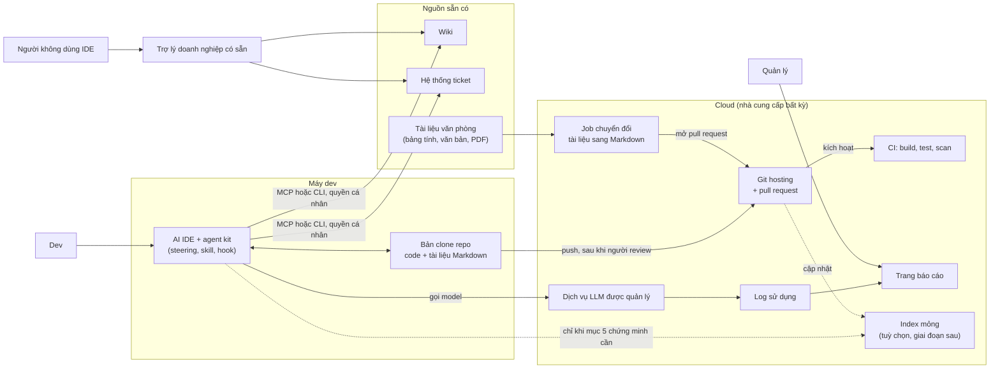

# Knowledge Platform Design Review

Cập nhật 2026-10-05. Bản nháp, chưa duyệt.

Tài liệu này đánh giá một bản thiết kế "AI platform kèm kho tri thức" do một team đề xuất, rồi đưa ra phương án gọn hơn. Nó nối tiếp lập trường ở [Position: Kits and Data, Not a New Harness](06-platform-or-kit-position.md).

**Kết luận:** hướng đi của bản đề xuất là đúng (IDE là nơi làm việc chính, platform chỉ cấp context), nhưng khoảng hai phần ba số component không nên làm ở giai đoạn này. Phần đáng giữ là bước chuyển tài liệu sang dạng agent đọc được, giao diện tra cứu chuẩn cho agent, và một trang báo cáo sử dụng.

**Giới hạn của bản đánh giá:**

- Đánh giá dựa trên sơ đồ kiến trúc, không có tài liệu mô tả yêu cầu đi kèm. Vai trò nghiệp vụ của từng cụm là suy luận từ nhãn trên sơ đồ.
- Chưa có phép đo nào trên dữ liệu thật. Mục 5 nêu cách kiểm chứng trước khi quyết.

## 1. Bản đề xuất gồm những gì

Bản đề xuất phục vụ quy trình phát triển lấy tài liệu làm gốc: yêu cầu, thiết kế cơ bản, thiết kế chi tiết, mã nguồn. Nó gồm năm khối:

| Khối | Nội dung |
|---|---|
| Máy dev | AI IDE với spec, steering, hook; nhận context từ platform qua MCP; người review rồi push |
| MCP server | Bốn tool: tìm code theo ngữ nghĩa, tìm tài liệu theo ngữ nghĩa, truy vấn đồ thị, sinh embedding |
| Máy chủ dữ liệu tri thức | Hai pipeline: làm giàu tài liệu (kéo, tách, chunk, embedding, dựng đồ thị, LLM làm giàu) và dựng đồ thị code (parse cú pháp, rút node và cạnh, embedding) |
| Kho tri thức | Vector DB, graph DB, DB trạng thái cho job và workflow, cache kèm lock |
| Web portal | Chat, Search, Approval, RBAC, Dashboard |

Quy mô ghi trên sơ đồ: dưới 200 nghìn vector cho cả tài liệu lẫn code.

## 2. Các cụm không nên làm

Mỗi cụm được xét theo hai tiêu chí:

- **Cần thiết:** nghiệp vụ có bị chặn nếu thiếu nó không, và đã có thứ khác làm việc đó chưa.
- **Hiệu quả:** giá trị mang lại so với công dựng và công vận hành.

| Mã | Cụm component | Mục đích dự kiến | Cần thiết | Hiệu quả | Đề xuất | Ảnh |
|---|---|---|---|---|---|---|
| C1 | Embedding code và tìm code theo ngữ nghĩa (vector DB phần code, bước embedding code) | Giúp agent tìm đoạn code liên quan | Thấp. Agent trong IDE đã tự tìm trên bản clone bằng tìm chuỗi, tìm file và đọc file | Thấp. Index chỉ phản ánh code đã push nên luôn trễ so với bản đang sửa; model embedding đa dụng không mạnh với code | Bỏ | _(bổ sung ảnh C1)_ |
| C2 | Pipeline đồ thị code và graph DB phần code | Phân tích ảnh hưởng: ai gọi ai, sửa chỗ này đụng chỗ nào | Thấp trong một repo: language server và tìm chuỗi đã trả lời được | Thấp. Parse cú pháp không có thông tin kiểu nên cạnh "gọi" thiếu chính xác; quan hệ xuyên dịch vụ, batch, bảng dữ liệu thì không bắt được | Bỏ. Xét lại khi có bằng chứng ở mục 5 | _(bổ sung ảnh C2)_ |
| C3 | Embedding tài liệu và tìm tài liệu theo ngữ nghĩa (vector DB phần tài liệu, bước chunk và embedding) | Giúp agent và người dùng tìm tài liệu dự án | Thấp khi tài liệu đã ở dạng văn bản: agent gọi thẳng wiki và hệ thống ticket | Thấp. Phải sao chép quyền đọc của từng tài liệu vào kho, nếu không sẽ lộ dữ liệu giữa các dự án | Bỏ. Thay bằng truy cập thẳng nguồn với quyền của từng người | _(bổ sung ảnh C3)_ |
| C4 | Đồ thị tài liệu và bước LLM làm giàu | Rút quan hệ giữa tài liệu, tóm tắt, gắn nhãn | Thấp. Truy vết yêu cầu sang thiết kế sang code làm được bằng mã định danh ghi trong tài liệu và commit | Thấp. Tốn chi phí model, kết quả không lặp lại được, khó kiểm tra đúng sai; tài liệu do AI sinh bị index lại thành nguồn | Bỏ. Thay bằng quy ước mã truy vết trong kit | _(bổ sung ảnh C4)_ |
| C5 | Hạ tầng phụ trợ của pipeline: DB trạng thái, cache kèm lock, hàng đợi bất đồng bộ | Điều phối job index và làm mới kho | Không còn khi bỏ C1 đến C4 | Không áp dụng | Bỏ theo C1 đến C4 | _(bổ sung ảnh C5)_ |
| C6 | Tool sinh embedding trên MCP server | Cho agent lấy vector của một đoạn văn bản | Không. Agent không dùng vector thô để làm việc | Không. Thêm một tool là thêm phần mô tả agent phải đọc mỗi phiên | Bỏ | _(bổ sung ảnh C6)_ |
| C7 | Web portal: Chat và Search | Cửa cho người không dùng IDE | Phụ thuộc vào việc có nhóm người dùng đó không. Với dev thì trùng với IDE | Thấp. Không có agent harness phía sau nên không chạy được quy trình của kit; cùng một yêu cầu cho kết quả khác chuẩn với IDE | Không xây. Dùng trợ lý doanh nghiệp có sẵn nối vào wiki và ticket | _(bổ sung ảnh C7)_ |
| C8 | Web portal: Approval và RBAC | Duyệt sản phẩm; phân quyền trên portal và kho | Thấp. Pull request và công cụ ticket đã có luồng duyệt kèm dấu vết; RBAC chỉ tồn tại để phục vụ portal và kho | Thấp. Thêm một nơi duyệt thứ hai làm quy trình rối hơn | Không xây. Giữ duyệt ở pull request | _(bổ sung ảnh C8)_ |
| C9 | Kích hoạt build từ hook trong IDE qua đường riêng | Build, test, scan mỗi lần agent sinh code | Thấp. Pipeline CI chạy khi push đã làm việc này | Thấp. Hai đường kích hoạt cho cùng một việc; mở thêm quyền cho agent gọi hạ tầng | Gộp về CI theo push. Hook trong IDE chỉ chạy kiểm tra tại máy | _(bổ sung ảnh C9)_ |

## 3. Các phần nên giữ

| Phần | Lý do giữ | Điều chỉnh |
|---|---|---|
| AI IDE kèm spec, steering, hook | Nơi quy trình được thực thi; đây chính là agent kit | Không đổi |
| MCP làm giao diện tra cứu cho agent | Chuẩn mở, đổi IDE không phải viết lại | Trỏ thẳng vào wiki và ticket, không qua kho trung gian |
| Bước tách nội dung tài liệu | Tài liệu thiết kế ở dạng bảng tính, văn bản văn phòng, PDF thì agent không đọc tốt | Đầu ra là Markdown lưu trong git cạnh code; không chunk, không embedding |
| Người review trước khi push | Điểm kiểm soát chất lượng duy nhất không tự động hoá được | Không đổi |
| CI: build, test, scan | Cổng chất lượng tất định | Chỉ kích hoạt theo push |
| Dashboard | Thứ duy nhất IDE không thay được: nhìn tổng hợp nhiều người, nhiều dự án | Thu lại thành một trang báo cáo đọc từ log sử dụng |
| Dịch vụ LLM được quản lý | Dữ liệu ở lại trong ranh giới cloud đã thoả thuận | Không đổi |

## 4. Phương án đề xuất

Phương án dựa trên ba ý:

1. **Đưa tri thức về nơi agent vốn đã đọc được.** Tài liệu thiết kế được chuyển sang Markdown và nằm trong git. Agent tìm bằng chính công cụ nó dùng cho code.
2. **Gọi thẳng nguồn, không sao chép.** Wiki và ticket được truy cập qua MCP hoặc CLI bằng quyền của từng người. Không có kho trung gian thì không có bài toán đồng bộ quyền và độ trễ index.
3. **Mua thay vì xây cho người không dùng IDE.** Nhóm này dùng trợ lý doanh nghiệp có sẵn.

| Thành phần | Việc phải làm | Loại dịch vụ cloud |
|---|---|---|
| Agent kit | Thêm quy ước mã truy vết và hướng dẫn agent tra wiki, ticket | Không cần |
| Kết nối wiki và ticket | Cấu hình MCP server hoặc CLI sẵn có, dùng token cá nhân | Không cần, hoặc một container nhỏ nếu chạy MCP tập trung |
| Job chuyển đổi tài liệu | Viết bộ chuyển đổi, chạy theo lịch hoặc khi tài liệu đổi, kết quả đi qua pull request | Tác vụ chạy theo lịch (container hoặc function) |
| Git hosting và CI | Dùng cái đang có | Dịch vụ git và CI được quản lý |
| Trang báo cáo | Đọc log sử dụng của dịch vụ LLM, tổng hợp theo người và dự án | Lưu trữ log và một công cụ dashboard |
| Trợ lý cho người không dùng IDE | Chọn sản phẩm có connector tới wiki và ticket, giữ quyền theo tài liệu gốc | Sản phẩm mua ngoài |
| Index mỏng (tuỳ chọn) | Một cơ sở dữ liệu quan hệ có phần mở rộng vector, hai đến ba tool MCP | Cơ sở dữ liệu quan hệ được quản lý |

So với bản gốc, phương án này không có vector DB, graph DB, DB trạng thái, cache, hàng đợi và web portal. Phần phải tự viết còn lại là bộ chuyển đổi tài liệu và trang báo cáo.

## 5. Kiểm chứng trước khi quyết

Phương án ở mục 4 dựa trên suy luận về cách agent làm việc, chưa dựa trên số đo. Trước khi chốt, nên chạy một phép thử:

1. Lấy 20 đến 30 câu hỏi thật của một dự án đang chạy, gồm tìm tài liệu, tìm code, và phân tích ảnh hưởng xuyên repo.
2. Cho agent trả lời theo hai cấu hình: (a) bản clone kèm truy cập thẳng wiki và ticket; (b) có thêm kho tri thức theo bản gốc, dựng ở mức thử nghiệm.
3. So độ đúng, thời gian và chi phí token cho từng câu.

Chỉ dựng index mỏng hoặc đồ thị code khi cấu hình (b) thắng rõ ở một nhóm câu hỏi cụ thể, và chỉ dựng cho nhóm đó.

Các điều kiện khiến kết luận đổi chiều:

- Số repo và tài liệu vượt mức một người clone được về máy.
- Lượng truy vấn đủ lớn để chi phí token của việc agent tự tìm vượt chi phí vận hành kho.
- Có nhóm người dùng không vào được IDE, không sản phẩm có sẵn nào qua được ràng buộc hợp đồng, và họ cần nhiều hơn hỏi đáp.

## Câu hỏi mở

1. Ca cụ thể nào hiện nay agent làm sai vì thiếu context, và bao nhiêu ca như vậy mỗi tuần?
2. Người dùng web portal là ai, bao nhiêu người, cần việc gì mà IDE không đáp ứng?
3. Chat trên portal là một lượt gọi model hay có vòng lặp tool? Nếu có thì chạy trên harness nào?
4. Khi nhiều bên dùng chung platform, ai sở hữu kho và ai được đọc phần nào?
5. Tài liệu do AI sinh có phải qua duyệt trước khi trở thành nguồn tra cứu không?
6. Repo dự án nằm ở dịch vụ git nào, và kho mã trong bản đề xuất là nguồn gốc hay bản sao?
7. Ai vận hành platform và chi phí hàng tháng dự kiến là bao nhiêu?
